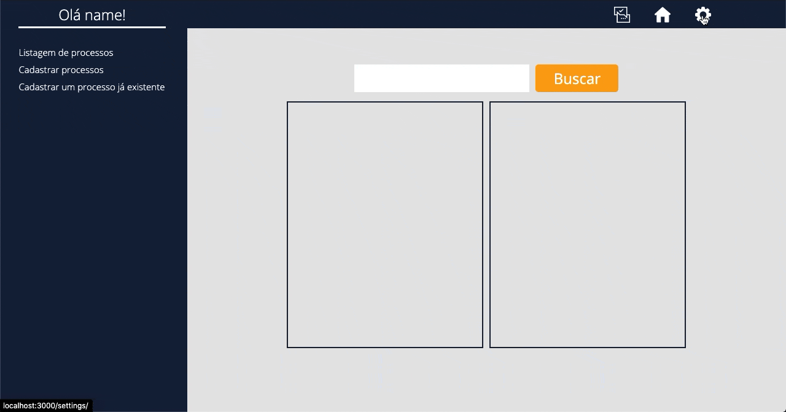

# System protocol

### Sistema para gerenciamento de processos administrativos

 
    

### Tecnologias que foram usadas:
- __FrontEnd__
  - React
  - Axios
  - Styled-componet
- __Backend__
  - Express
  - SQlite
  - Knex

### Para que serve:
Este projéto está em desenvolvimento, atulmente ele __cadastra__ e __consulta__ processos.
